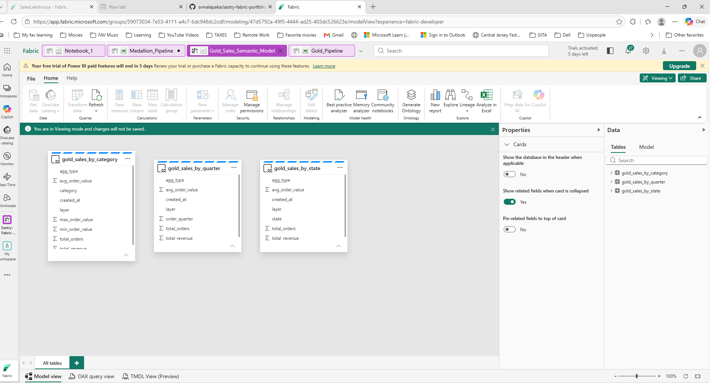

# 🧱 Portfolio Project #1 — Structure & Organization

This document defines the folder structure, naming conventions, and screenshot standards used in **Portfolio Project #1 — Sales Lakehouse**.  
It establishes the documentation format followed across the entire Microsoft Fabric portfolio.

---

## 📁 Folder Structure

```
/Documentation
/Lakehouse
/Pipelines
/Reports
/Screenshots
/Code
```

### Folder Purpose Overview

| Folder | Purpose |
|--------|---------|
| **Documentation** | Markdown files describing architecture, pipelines, Power BI, and project overview |
| **Lakehouse** | Medallion layer notes, Lakehouse structure, SQL Endpoint references |
| **Pipelines** | Bronze, Silver, Gold pipeline logic and visuals |
| **Reports** | Power BI Gold validation report and supporting visuals |
| **Screenshots** | All images used across documentation (workspace, lakehouse, pipelines, Power BI) |
| **Code** | Scripts, notebooks, transformations, and supporting logic |

---

## 🧱 Naming Conventions

Consistent naming ensures clarity and easy reference across documentation.

### Pipeline Screenshots
- `bronze_pipeline.png`
- `silver_pipeline.png`
- `gold_pipeline.png`
- `medallion_pipeline.png`

### Power BI Screenshots
- `powerbi_gold_validation.png`
- `powerbi_matrix_view.png`
- `powerbi_category_breakdown.png`

### Lakehouse & Workspace Screenshots
- `workspace_overview.png`
- `lakehouse_explorer.png`
- `lakehouse_empty.png`

---

## 📸 Screenshot Guidelines

To maintain consistency across Project 1 and Project 2:

### General Rules
- Use **one screenshot per section** (workspace, lakehouse, pipelines, Power BI).
- Store all visuals in `/Screenshots`.
- Use **clear, descriptive filenames**.
- Maintain consistent dimensions and clarity.

### Markdown Embedding Format
Use relative paths for all images:

```markdown



```

---

## 🧩 Example Visual Flow

### 🗂️ Workspace Overview


### 📁 Lakehouse Explorer


### 🥉 Bronze Pipeline


### 🥈 Silver Pipeline


### 🥇 Gold Pipeline


### 📊 Power BI Gold Validation


---

## 🧾 Summary

Portfolio Project #1 establishes the foundational structure for your Microsoft Fabric portfolio.  
It defines a clean, modular, and scalable documentation pattern that continues into Project 2 and future Fabric implementations.

