Gold Layer — HR Analytics KPI Generation
Project: Microsoft Fabric Medallion Architecture — Project 2 (HR Analytics)  
Author: Sastry
Layer: Gold — Business‑Ready KPI Tables & Aggregations

📌 Overview
The Gold layer transforms curated Silver data into business‑ready HR analytics, including KPI tables, aggregated attrition metrics, and SQL‑published tables for downstream reporting.

This layer represents the final stage of the Medallion architecture:

Bronze: Raw ingestion

Silver: Cleaned, typed, standardized employee dataset

Gold: KPI‑rich, analytics‑ready HR insights

The Gold notebook (gold_transformations_Notebook.ipynb) computes KPIs, builds employee‑level Gold tables, and publishes them to both Delta and SQL for Power BI consumption.

🧱 Input Dataset (Silver Layer)
The Silver Delta table contains the following columns:

Code
employeeid
name
age
gender
department
jobrole
education
maritalstatus
hiredate
yearsatcompany
yearsincurrentrole
monthlyincome
jobsatisfaction
performancerating
attrition
worklifebalance
trainingtimeslastyear
overtime
distancefromhome
environmentsatisfaction
This dataset is loaded from:

Code
Files/Silver/Silver_HR_Employee_Data
⭐ Gold KPIs Generated
1. Core Metrics
Total Employees

Attrition Count

Attrition Rate

Average Monthly Income

Average Age

Average Years at Company

2. Attrition by Key Dimensions
Department

Job Role

Gender

Education

Overtime

Marital Status

Job Satisfaction

Environment Satisfaction

(BusinessTravel was excluded because the dataset does not contain that column.)

🏗️ Gold KPI Table (Employee Grain)
The Gold table includes:

Code
- employeeid
- department
- jobrole
- gender
- monthlyincome
- attrition
- yearsatcompany
- jobsatisfaction
- environmentsatisfaction
- maritalstatus
- education
- overtime
This table is saved as:

Delta
Code
Files/Gold/Gold_HR_Employee_KPIs
SQL Table
-dbo.gold_hr_employee_kpis
📊 KPI Summary Table
A single‑row summary table is generated with:

- TotalEmployees

- AttritionCount

- AttritionRate

- AvgMonthlyIncome

- AvgAge

- AvgYearsAtCompany

Published as:
- dbo.gold_hr_employee_kpi_summary

📁 Gold Folder Structure
Your Gold folder contains:

Gold/
- gold_transformations_Notebook.ipynb
- README_Gold.md
- Loaded Silver Table.
  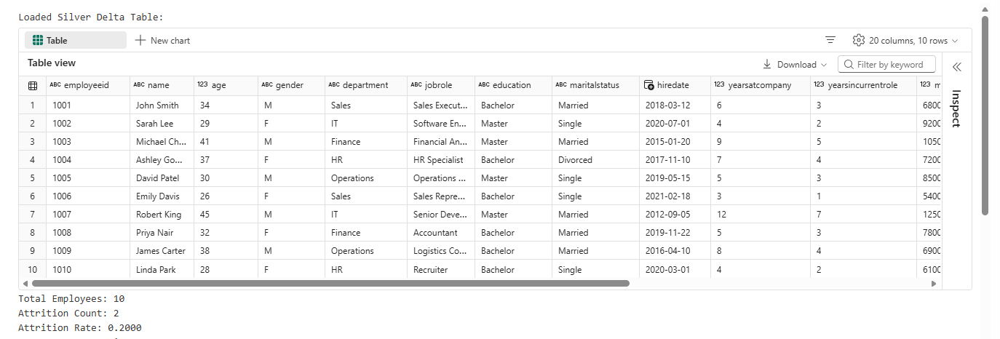
  
- Gold_KPI_Aggregations.
 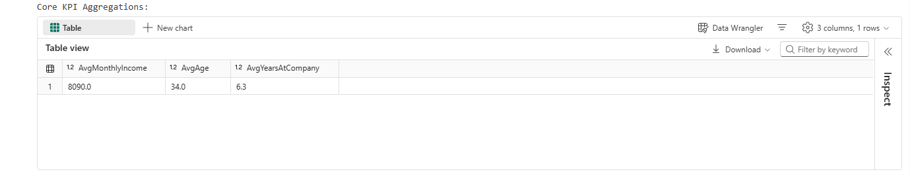

- Attrition By Department.
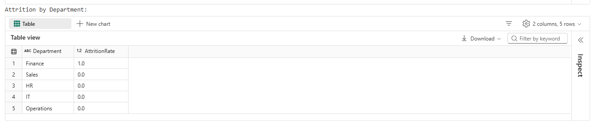

- Attrition JobRole.
  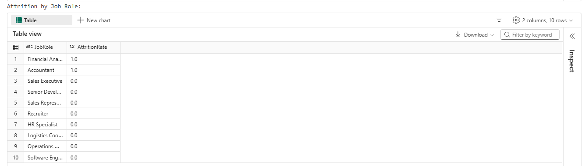
  
- Gold_Attrition_Gender.
  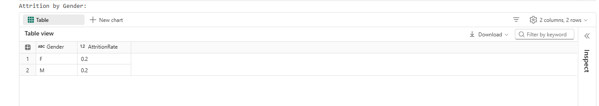
  
- Gold_Attrition_Education.
  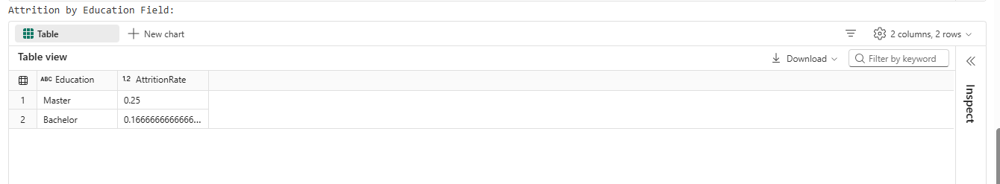
- Gold_Attrition_Overtime
  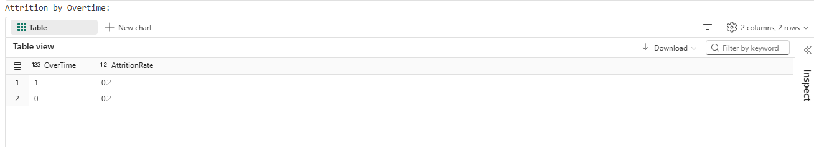
  
- Gold_Attrition_MaritalStatus
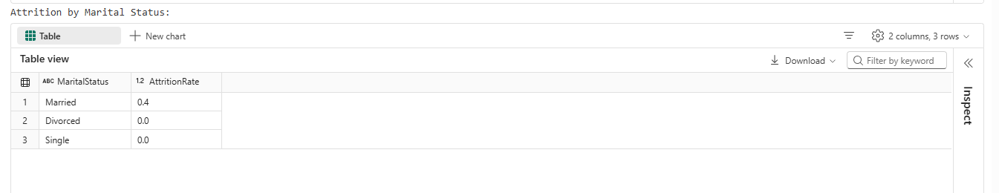
  
- Gold_Attrition_JobSatisfaction
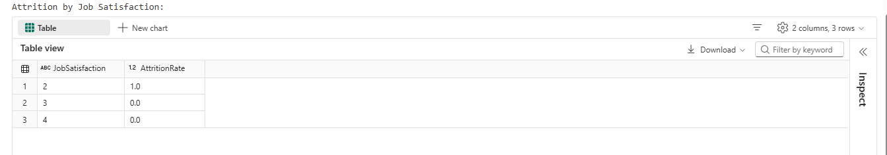

- Gold_Attrition_EnvironmentSatisfaction
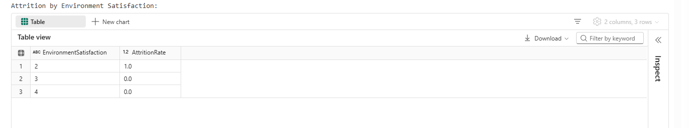

- Gold_Folder_View
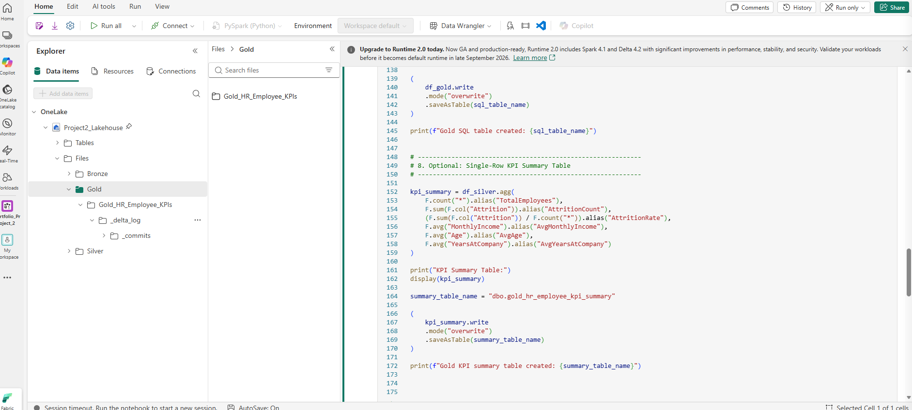
These screenshots document each transformation stage and KPI output.

🖼️ Screenshots Included
Your Gold documentation includes the following visuals:

Loaded Silver Delta Table

Core KPI Aggregations

Attrition by Department

Attrition by Job Role

Attrition by Gender

Attrition by Education

Attrition by Overtime

Attrition by Marital Status

Attrition by Job Satisfaction

Attrition by Environment Satisfaction

Gold Folder View (Delta + SQL outputs)

These screenshots validate the correctness of the Gold transformations.

🚀 Conclusion
The Gold layer successfully converts curated Silver HR data into analytics‑ready KPI tables, enabling:

HR dashboards

Attrition analysis

Compensation insights

Workforce trend reporting

Executive‑level summaries

This completes Project 2 — Gold Layer of your Microsoft Fabric Medallion Architecture portfolio.
