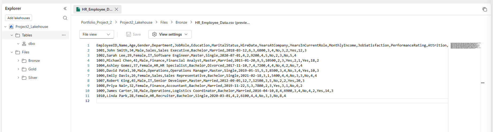

# 🏗️ Lakehouse Structure — Project 2

This document describes the Lakehouse structure for Portfolio Project 2, including folder organization, tables, and medallion layer design.

---

## 📁 Lakehouse Layout

Lakehouse

Files/
- Bronze/
- Silver/
- Gold/

Tables/
- BronzeTables
-  SilverTables
- GoldTables

---

## 🥉 Bronze Layer — Raw Data Ingestion

The Bronze layer stores the raw HR dataset exactly as uploaded, without any transformations.  
For Project 2, the file **HR_Employee_Data.csv** was uploaded into:

`Project2_Lakehouse → Files → Bronze`

### Key Points
- Raw CSV ingestion  
- No transformations applied  
- Schema validated successfully  
- Data preview confirmed

### Screenshot

## 🥈 Silver Layer

- Cleaned and standardized datasets  
- Column renaming  
- Data type corrections  
- Stored in `/Files/Silver/`  

---

## 🥇 Gold Layer

- Aggregated business-ready analytics  
- Measures and KPIs  
- Stored in `/Files/Gold/`  

---

## 🔗 SQL Endpoint

The Lakehouse SQL Endpoint is used for Power BI connectivity and Gold layer validation.
