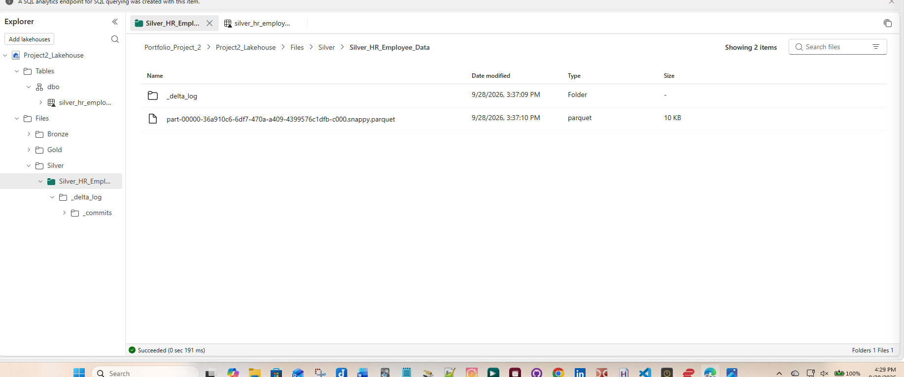
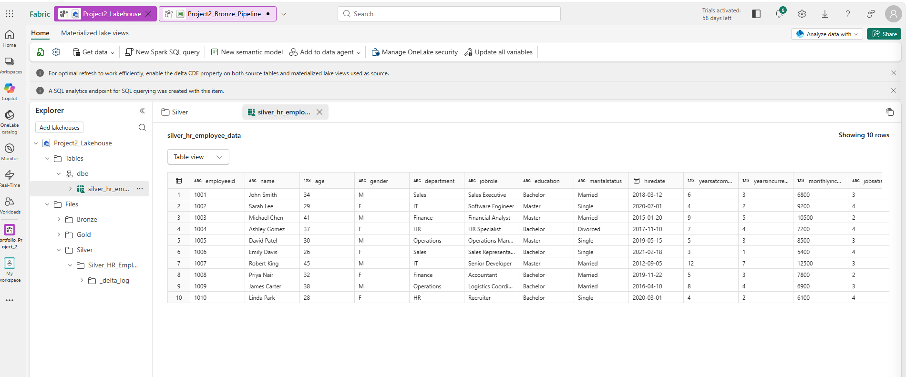

# 🥈 Silver Layer — Data Cleaning & Standardization

## Overview
The Silver layer refines raw HR data from the Bronze layer (`HR_Employee_Data.csv`) into a clean, standardized Delta table ready for analytics.

## Transformations Applied
- Standardized column names and data types  
- Converted categorical fields (Gender, Attrition, Overtime) to numeric values  
- Removed nulls and inconsistent entries  
- Stored output as Delta table for efficient querying  

## Output Path
`/Files/Silver/Silver_HR_Employee_Data/`

## Output Table
`dbo.silver_hr_employee_data`

## Screenshots
### 📂 Transformation Notebook

### 📊 Table Preview

## Notebook Reference
`silver_transformations_Notebook.ipynb`

## Notes
This layer ensures schema consistency and prepares data for Gold-level business KPIs.
