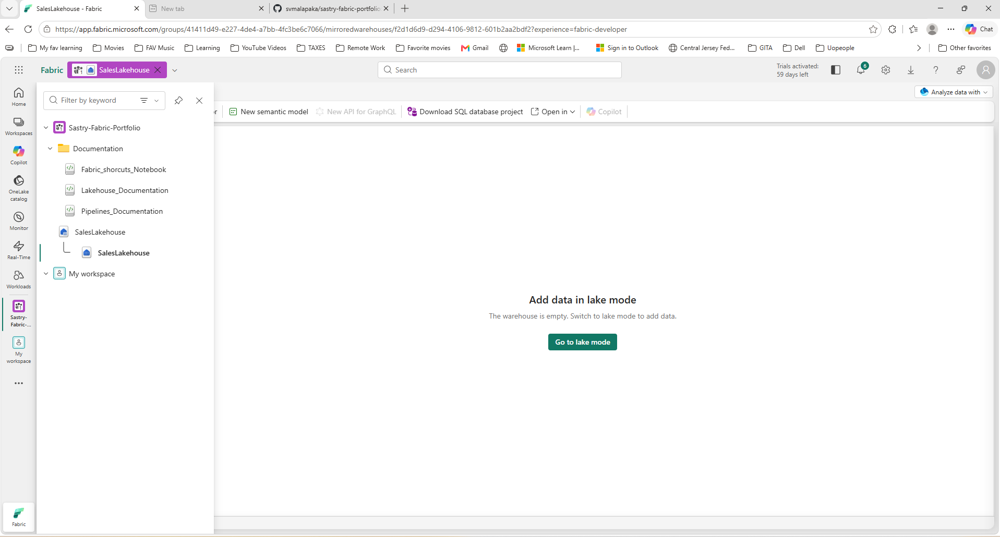
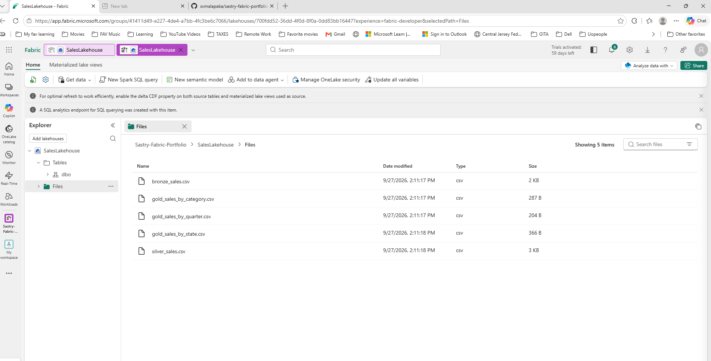
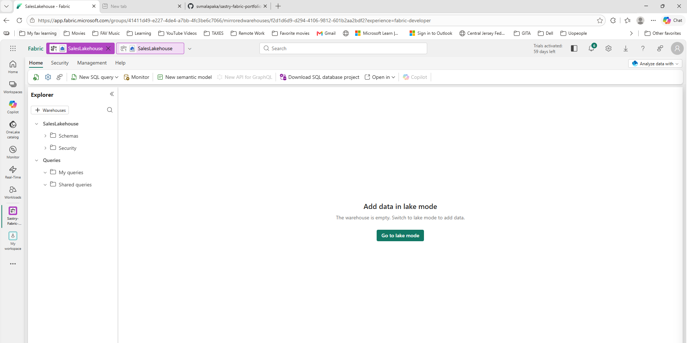
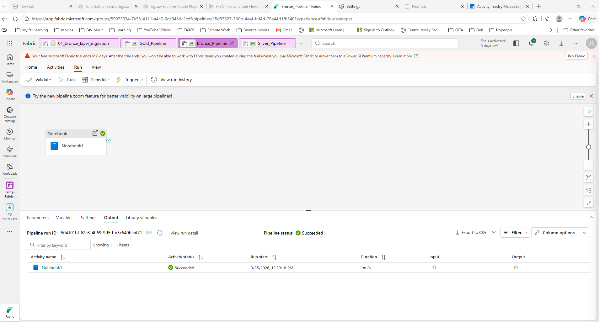
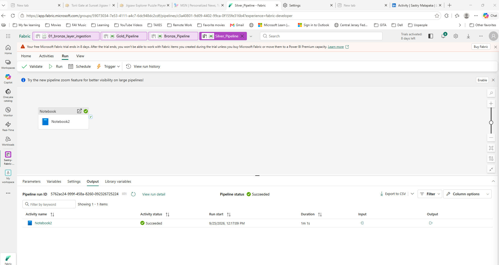
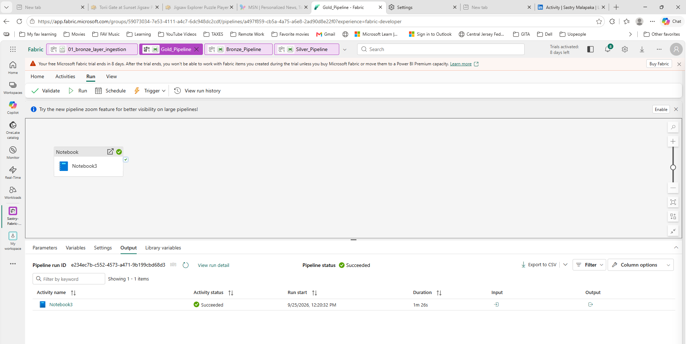
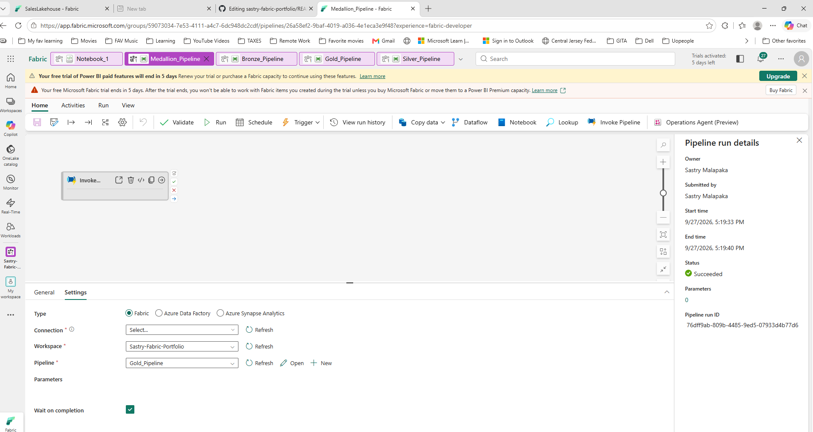

# Sastry Fabric Portfolio — Sales Lakehouse Project

This repository contains an end‑to‑end Microsoft Fabric portfolio project demonstrating Lakehouse architecture, automated Medallion pipelines (Bronze/Silver/Gold), SQL endpoint integration, validated Gold analytics, and complete engineering documentation using Fabric notebooks.

---

## 📘 Documentation

All project documentation is stored in the `/Documentation` folder:

- **Fabric_Shortcuts_Notebook.ipynb**  
- **Lakehouse_Documentation.ipynb**  
- **Pipelines_Documentation.ipynb**

These notebooks describe the workspace structure, lakehouse configuration, pipeline flows, and reporting architecture.

---

## 🏗️ Lakehouse Architecture

The `/Lakehouse` folder contains screenshots and notes for:

- **Bronze tables** — raw ingested data  
- **Silver tables** — cleaned and standardized datasets  
- **Gold tables** — aggregated analytics for reporting  
- **SQL endpoint views** — query-ready layer for Power BI  

This project uses a structured **Medallion architecture** to build reliable analytical datasets.

### 📸 Visuals

Below are key visuals from the Fabric Lakehouse setup:

Workspace Overview

Lakehouse Explorer

Lakehouse Empty View

---

## 🔧 Medallion Pipelines (Bronze → Silver → Gold)

The `/Pipelines` folder contains screenshots and notes for all automated Fabric pipelines used in this project:

- **Bronze Pipeline** — raw ingestion from source files  
- **Silver Pipeline** — cleaning, standardization, and schema alignment  
- **Gold Pipeline** — business‑ready aggregations for reporting  
- **Medallion Pipeline** — unified end‑to‑end automation across all layers  

Each pipeline is validated with successful run history and follows Fabric best practices for modular, reusable, and scalable data engineering workflows.

### 📸 Pipeline Visuals

Below are key visuals from the Fabric pipeline setup:

---

## 📊 Power BI Gold Analytics

The `/Reports` folder contains:

- **Gold Sales Validation Report (PBIX)**  
- Report screenshots  

The report connects to the Lakehouse SQL endpoint and uses Gold tables for clean, validated analytics.

---

## 🖼️ Screenshots

The `/Screenshots` folder includes workspace, lakehouse, and pipeline visuals that support documentation and portfolio presentation.

---

## ✔ Summary

This repository represents **Portfolio Project #1** for Microsoft Fabric, showcasing:

- Lakehouse engineering  
- Medallion pipelines  
- SQL endpoint integration  
- Power BI Gold analytics  
- Full documentation notebooks  
- Clean GitHub structure  

More Fabric projects will be added as the portfolio expands.

---
